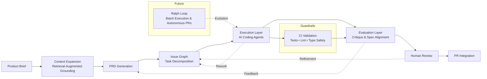

# Agentic Software Delivery Pipeline

AI-driven delivery system that turns a product brief into reviewed pull requests through constrained orchestration.

## Architecture (Primary)

### **Brief -> Context Expansion -> PRD -> Issue Graph -> Agent Execution -> Human Review -> PR Integration**

This lifecycle is iterative, not single-pass: execution and review outcomes can trigger PRD refinement, issue-graph updates, and re-execution before merge.

1. Start with a high-level product brief.
2. Expand context via retrieval-augmented grounding from repository and documentation sources.
3. Generate a structured PRD with scope and acceptance criteria.
4. Decompose the PRD into dependency-aware GitHub issues.
5. Execute issues with AI agents that produce code and tests.
6. Gate integration through human review and CI validation.

## Agent Model

- Planning layer: PRD generation and issue decomposition.
- Execution layer: bounded task implementation under repository constraints.
- Evaluation layer: critique, regression detection, and spec alignment.

## Ralph Loop (Planned)

Next evolution: a value-prioritised batch execution mode that selects the highest-value available issues first, delivers them to pull request state, and applies pre-merge validation via internal critique agents.

Ralph Loop does not merge autonomously. It runs until all selected issues are in pull request state, or until the next highest-value issue is blocked and requires human review.

## Guardrails

- Agent outputs are validated against PRD acceptance criteria.
- CI enforces correctness constraints (tests, linting, type safety, build, visual checks).
- Human review is required before any merge.
- Structured artefacts reduce hallucination risk versus free-form generation.
- The system is designed for constrained autonomy, with explicit validation boundaries.

## UI component architecture rule

- All new UI components must be co-located with their Storybook story in the same folder.
- A new UI component is not complete without at least one story.
- Reference ADR: `docs/adr/0011-component-co-location-and-story-required-for-new-ui-components.md`.

## Implementation Layer

Supporting infrastructure (execution substrate):

- Next.js + TypeScript
- Supabase + Drizzle
- Vitest + Playwright + Storybook
- GitHub Actions

## Philosophy

Structured AI-assisted engineering: decompose work, generate explicit artefacts, validate continuously, and integrate under human control.
